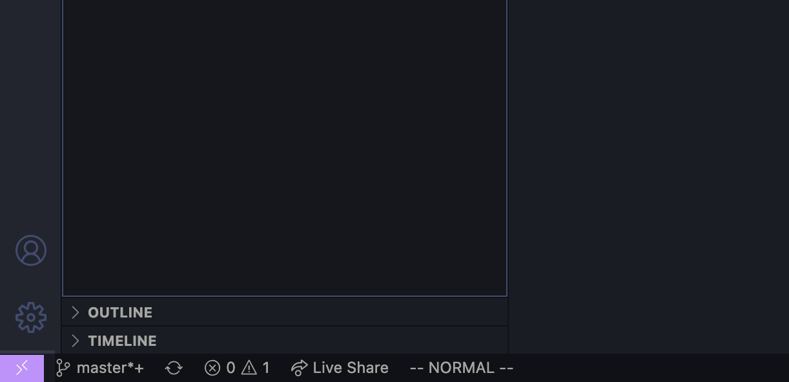
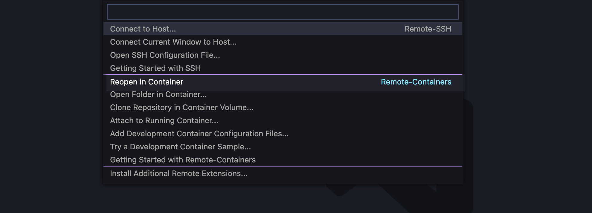

# cFS Pi

A Docker-based development environment for you to cross-compile NASA's Core
Flight System (cFS) to the Raspberry Pi.

## Description

The cFS Pi project provides an all-in-one development environment for
cross-compiling the NASA Core Flight System (cFS) to the Raspberry Pi. The
project is based upon leveraging Docker and Visual Studio Code to provide
a devcontainer environment that contains all the tooling you need to compile
cFS for either the host x86_64 Ubuntu OS or for the Raspberry Pi OS.

The [cFS](https://github.com/nasa/cFS) is an open-source generic flight
software architecture framework used on flagship NASA spacecraft like the
Parker Solar Probe, Orion, and the James Webb Space Telescope to name a few. In
this project I use the `Caelum RC4` version of cFS.

## Dependencies

- Docker
- Visual Studio Code with the [Remote-Containers](https://marketplace.visualstudio.com/items?itemName=ms-vscode-remote.remote-containers) extension
- Raspberry Pi running Raspberry Pi OS or Raspberry Pi OS Lite

## Setup

### Raspberry Pi Setup
The easiest and fastest way to get an image flashed to the SD card for the Pi
is to just use the [Raspberry Pi Imager](https://www.raspberrypi.com/software/).

Flash either the _Raspberry Pi OS_ or the _Raspberry Pi OS Lite_ image to the
SD card for the Raspberry Pi.

> If you are operating the Raspberry Pi headless you'll need to enable SSH on
boot by adding an empty _ssh_ file to the root of the boot partition. You can
do this on Mac OS by running `touch /Volumes/boot/ssh` while the SD card is
plugged into your Mac.

### VS Code Project Setup

The project contains a `.devcontainer` folder that Visual Studio Code recognizes
to repoen the project in the Docker image that's defined in `.docker/Dockerfile`.
If you open this project in Visual Studio Code (with the Remote-Containers
extension installed) you should see a pop-up window in the bottom right that
says "Reopen In Container?" with a yes/no option. If you don't see that pop-up
you can click on the bottom left "connection" button:


and then the "Reopen in Container" option:


VS Code will build the image if it isn't already built and reopen the project
in a new container. The best part about VS Code's development container feature
is that your changes persist outside of the container in the project.

### Docker Compose Project Setup

If you are not a fan of Visual Studio Code or just like working in the command
line, you can also get up and running by just going to the project folder in a
terminal and entering:

```sh
docker compose up -d cfs-pi
docker compose exec cfs-pi bash
```

## Building

In order to build the cFS suite for the host x86_64 Ubuntu image simply run:

```sh
make SIMULATION=native O=build-native install
```

To cross-compile cFS for the Raspberry Pi run the following:

```sh
make SIMULATION=raspberrypi O=build-raspberry install
```

## Flashing Raspberry Pi

The first thing you need to do to get the cFS build onto the Raspberry Pi is to
get the local IP address of your Pi. The simplest way to do this is by trying the
following from your host machine (outside of the Docker container):

```sh
# Make sure your Raspberry Pi is connected
ping raspberrypi.local
```

> You might need to run the above commands on the host OS and **not** in the
Docker container. I kept getting a "Name or service not known" error when I 
tried it from inside of the container. The good thing is I got the other
commands to work from _inside_ of the container!

Once you get the address of your Raspberry Pi you can copy the cFS build folder
over to it by running:

```sh
# Copies the cpu1 executables and files to the home folder of the Pi
scp -r build-raspberry/exe/cpu1 pi@{RPI_ADDRESS}:~
```

> It will ask you for a password. If you are working with a fresh installation
of Raspberry Pi OS that password is usually `raspberry`.

### Executing program

Once your cFS build is on the Raspberry Pi you can run it by first SSH'ing into
it:
```sh
ssh pi@{RPI_ADDRESS}
```

and run it with:

```sh
sudo ./core-cpu1
```

## Authors

* @astroesteban

## License

This project is licensed under the MIT License - see the LICENSE file for details

## Acknowledgments

* [NASA's Core Flight System](https://github.com/nasa/cFS)